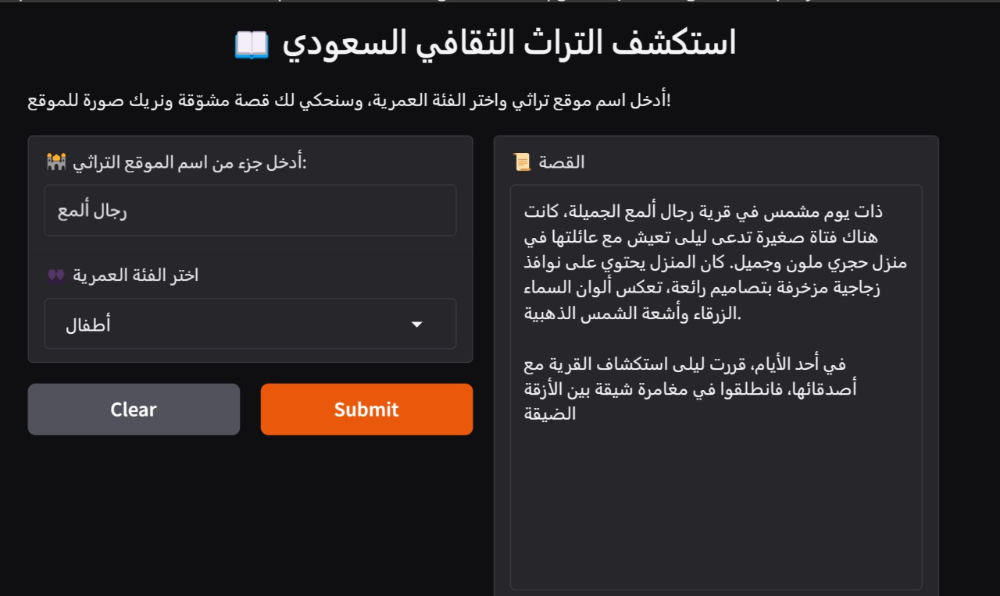

# Saudi Cultural Heritage Storyteller  

This project uses the **ALLAM-AI/ALLaM-7B-Instruct-preview** model to generate short stories about Saudi cultural heritage sites.  
The stories are adapted to different age groups (children, teenagers, adults) using prompt engineering.  

---

## Features
- Story generation using Hugging Face `transformers`.  
- Gradio interface for interactive use.  
- Age-based story adaptation (children, teenagers, adults).  
- Dataset includes Saudi heritage sites with name, description, region, and source.  

---

## Tech Stack
- **Language:** Python 3.x  
- **Libraries:** Hugging Face Transformers, Gradio, Pandas  
- **Environment:** Google Colab / Local Python  

---

## Project Structure
```
Saudi-Cultural-Heritage-Storyteller/
│
├── allam.ipynb          # Main notebook (Colab / Jupyter)
├── allam.py             # Python script for optional local run
├── dataset.csv           # Heritage sites dataset
├── requirements.txt      # Dependencies
├── README.md             # Project documentation
└── images/               # Screenshots and demo images
```

---

## Dataset
The dataset contains:  
- Site name  
- Description  
- Region  
- Source  

The dataset was collected by team members through web scraping.  

---

## Methodology
1. **Data Preparation** – heritage sites dataset collected via web scraping.  
2. **Prompt Engineering** – designed structured prompts for children, teenagers, and adults.  
3. **Story Generation** – used the ALLAM-7B-Instruct-preview model via Hugging Face.  

---

## Installation
Clone the repository and install dependencies:  
```bash
git clone https://github.com/<username>/Cultural-Heritage-Storyteller.git
cd Cultural-Heritage-Storyteller
pip install -r requirements.txt
```

---

## How to Run

### Option 1: Notebook (recommended)
1. Open the notebook on Google Colab:  
[Open in Colab](https://colab.research.google.com/github/<username>/Cultural-Heritage-Storyteller/blob/main/Allam2.ipynb)  
2. Run all cells. The Gradio interface will start and provide a local link.  

### Option 2: Local run with Python
```bash
python allam2.py
```

---

## Demo
-   

---

## Results
- Example prompt (teenagers): *"Generate a story about Diriyah for teenagers"*  
- Generated story (excerpt):  
  *"Diriyah was once the beating heart of the Arabian Peninsula..."*  
- Results are qualitative (story samples) demonstrated in the demo section.  

---

## Contribution and Role
This was a group project.  

- My primary responsibility was **prompt engineering** for adapting the ALLAM model to generate stories.  
- I attempted to fine-tune the model, but due to its large size and hardware limitations, I relied on prompt engineering instead.  
- The dataset collection was handled by other members through web scraping.  

---

## Author
- Leena Alotaibi  
- Email: leenanalotaibi@gmail.com  
- GitHub: [xlwynee](https://github.com/xlwynee)  
